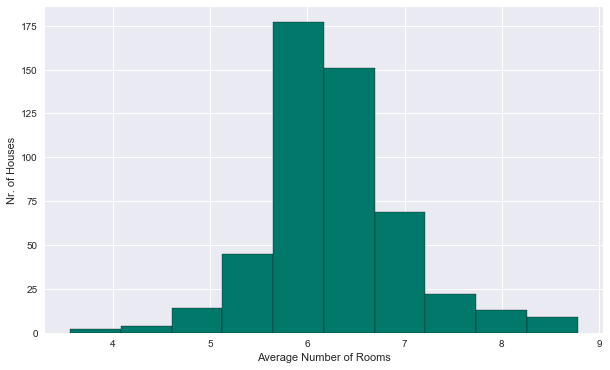
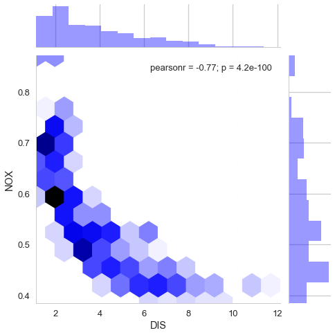
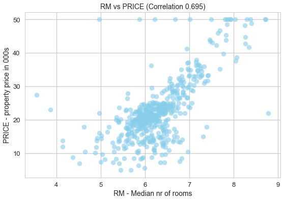

# Predict House Prices : Project Overview

* Build a home valuation tool
   

## Business Problem
  
  
  People who want to value of home in Bosten area by their requirements.

## Gather Data
  Get details about [Boston Dataset](https://scikit-learn.org/stable/modules/generated/sklearn.datasets.load_boston.html)
   
## EDA
##### These are some visualization which explain deep inside information about Boston houses prices.
#### Histogram
       
#### Scatter Plot   
   
#### Joint Plot   
      
   
   
   

#### Heatmap   
   
      
      
## Model
