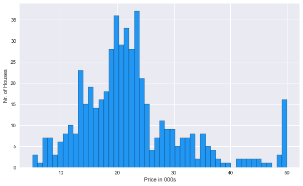
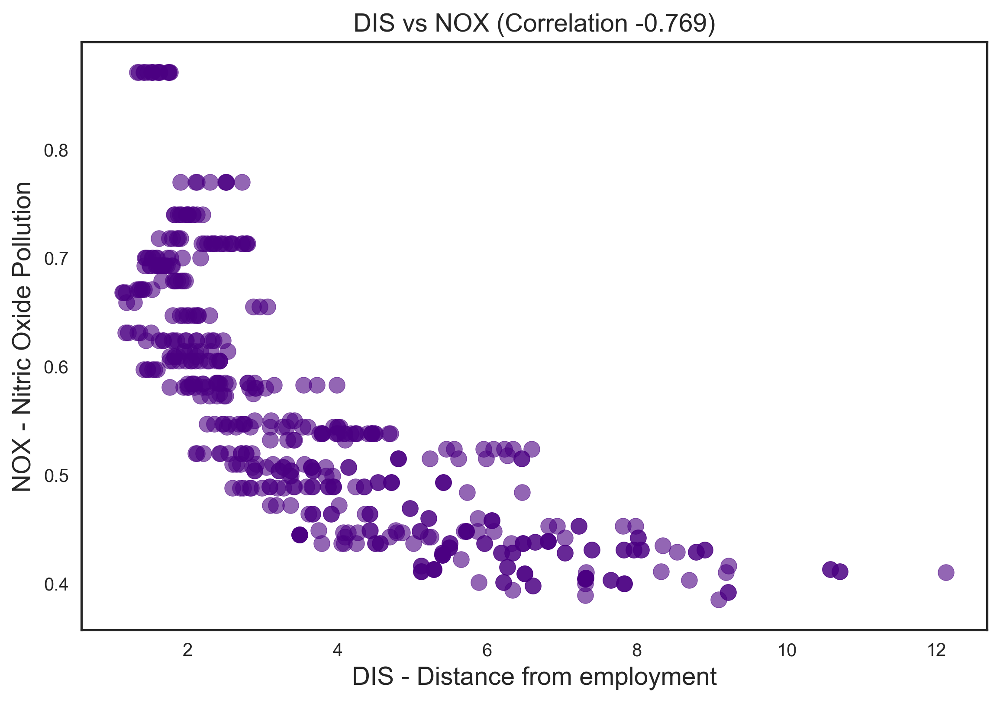
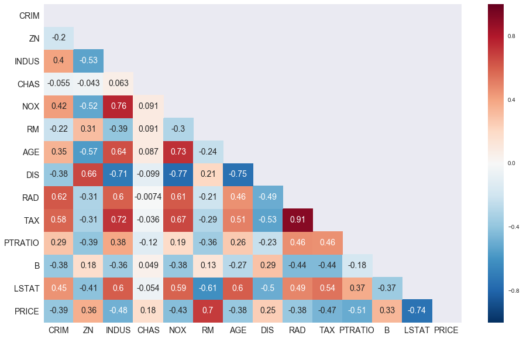

# Predict House Prices : Project Overview

* Solving problem of house prices for new home buyer.
* Build a home valuation tool.

      This tool predict house prices in Boston area which help peoples to find home by their budgets and requirements.

## Business Problem
  
  
  * Most people want to buy home in city and a specific area but they don't know price of house in this area.
  * For solving this problem we have to make model that help people to buying new home.

## Gather Data
  Get details about [Boston Dataset](https://scikit-learn.org/stable/modules/generated/sklearn.datasets.load_boston.html)
   
## EDA
##### These are some visualization which explain deep inside information about Boston houses prices.
#### Histograms
       
     
   
#### Scatter Plot   
   
      

#### Joint Plot   
    

#### Heatmap   
   
      
      
## Model
